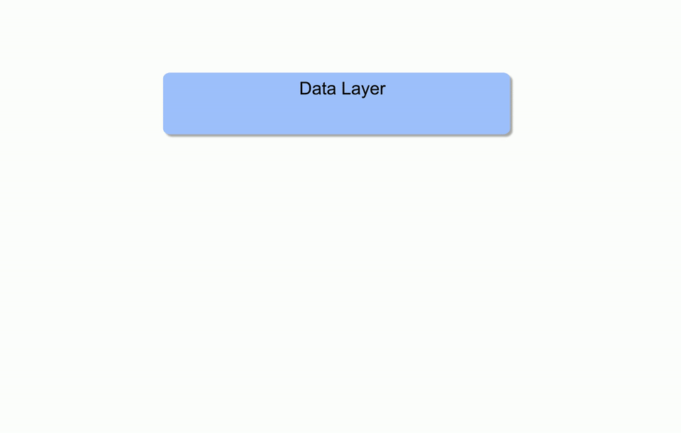
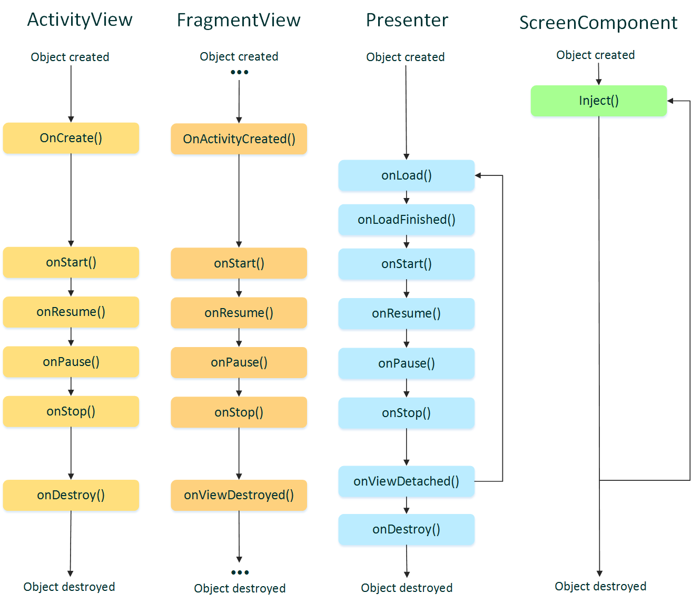

#### ** THIS REPO IS DEPRECATED AND IS NO LONGER BEING ACTIVELY MAINTAINED **

Ferro evolved into modules `core-ui`, `core-mvp`, `mvp-dialog`, `mvp-widjet` [Surf Android Standard](https://github.com/surfstudio/SurfAndroidStandard/) repository (Documentation in Russian). It contains modules, which is used for developing Android projects by mobile studio [Surf](http://surfstudio.ru/).

# Ferro

Simple and powerful MVP library for Android 

Ferro elegantly solves two age-old problems of Android Framework related to configuration changes:
* restore screen's data
* managing background tasks

First problem is solved using permanent presenter, second - using freezing rx events (Observable doesn't unsubscribe).
Also new feature was added - Ferro can freeze rx event when screen becomes invisible, and defreeze it when screen goes to foreground.

The schematic work of ferro:



Ferro is divided into 3 layers, each of one adds behavior to the previous. So you can use only part of Ferro, if you want.

The first layer:
## ferro-core
This library contains base classes for Activity and Fragment (`PSSActivity, PSSFragmentV4`, PSS - persistent screen scope). For each activity and fragment, based on this classes, will be created `PersistentScreenScope`.  You can get it by calling the method `PSSActivity#getPersistentScreenScope` or `PSSFragmentV4#getPersistentScreenScope`. This object isn't destroyed when configuration changed, it is only destroyed when screen is finally destroyed (e.g. after call `Activity#finish()`). You can add listener, which will be called when `PersistentScreenScope` destroyed. It has methods for storing and getting objects.
In reality, `PersistentScreenScope` is actually a retained Fragment without view.

This mechanism is perfect for storing a presenter, that is done in the next extention:
## ferro-mvp
This library contains base classes for view, presenter and screen component. For each screen you need to extend `ScreenComponent`, `MvpPresenter` and `MvpActivityView` or `MvpFragmentV4View`. 

The `ScreenComponent` will be saved in `PersistentScreenScope` and reused when view recreated. In method `ScreenComponent#inject(view)` you need to insert presenter to the view. The easiest way to do it is to use dagger component as `ScreenComponent`. Due to this mechanism presenter is reused after configuration change. 

Method `MvpPresenter#onLoad(viewRecreated)` will be called, when view is ready. Boolean parameter `viewRecreated` means that view is recreated after configuration change. You should show previously loaded data via this method, it data exists.

In `MvpActivityView` you should override method `#onCreate()` with parameter `viewRecreated` instead of default method `#onCreate()`. Same for `MvpFragmentV4View` and `onActivityCreated` method.

If you use Dagger, this library contains two scope annotations `@PerApplication` and `@PerScreen`. It also contains `ActivityProvider` and `FragmentProvider`, which can be used for getting access to Activity or Fragment inside objects, provided by Dagger screen component (e.g. inside Navigator class).

It's lifecycle of screen's objects: 


The next extention adds freeze logic for Rx events:
## ferro-mvp-rx
Class `MvpRxPesenter` contains freeze logic, scematic work of which shown in gif above. This class should be extended instead of `MvpPresenter`.

If you subscribe to `Observable` via one of `MvpRxPesenter#subscribe()` methods,
all rx events (onNext, onError, onComplete) would be frozen when view destroyed and unfrozen
when view recreated.
If option `freezeEventOnPause` is enabled (it is enabled by default), all Rx events
would be also frozen when screen is paused and unfrozen when screen is resumed.

When screen is finally destroyed, all subscriptions would be automatically unsubscribed.

## ferro-rx
This library contains rx operators (`ObservableOperatorFreeze`, `MaybeOperatorFreeze`, `SingleOperatorFreeze`, `CompletableOperatorFreeze`, `FlowableOperatorFreeze` for RxJava2 and `OperatorFreeze` for RxJava1), which contains freeze logic. To apply it, you should pass this operator in method `Observable#lift()`.


## Conclusion 
Nobody likes to do the basic logic of the project dependent on third-party libraries. So, the Ferro is, generally speaking, set of simple ideas, and you can create you own base classes by using this ideas.

## Dependency
```groovy
repositories {
      jcenter()
   }
```

```groovy
dependencies {
      //for use the full ferro (still not support RxJava2)
      compile 'com.agna.ferro:ferro-mvp-rx:1.1.2'
      //for use the part of ferro
      compile 'com.agna.ferro:ferro-core:1.1.2'
      compile 'com.agna.ferro:ferro-mvp:1.1.2'
      compile 'com.agna.ferro:ferro-rx:1.0.2' 
      //or if you use RxJava2
      compile 'com.agna.ferro:ferro-rx:2.0.0'
   }
```

## License
```
Copyright 2016 Maxim Tuev

   Licensed under the Apache License, Version 2.0 (the "License");
   you may not use this file except in compliance with the License.
   You may obtain a copy of the License at

       http://www.apache.org/licenses/LICENSE-2.0

   Unless required by applicable law or agreed to in writing, software
   distributed under the License is distributed on an "AS IS" BASIS,
   WITHOUT WARRANTIES OR CONDITIONS OF ANY KIND, either express or implied.
   See the License for the specific language governing permissions and
   limitations under the License.
```

